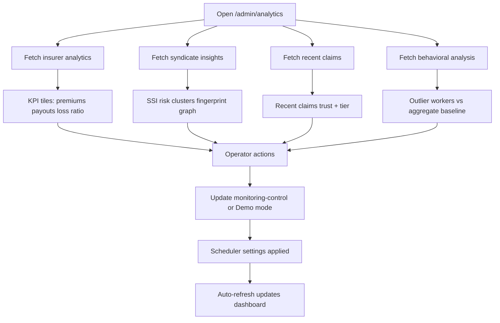
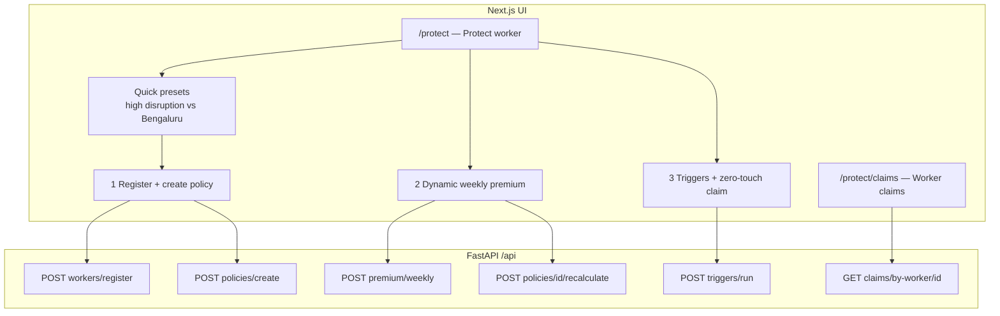
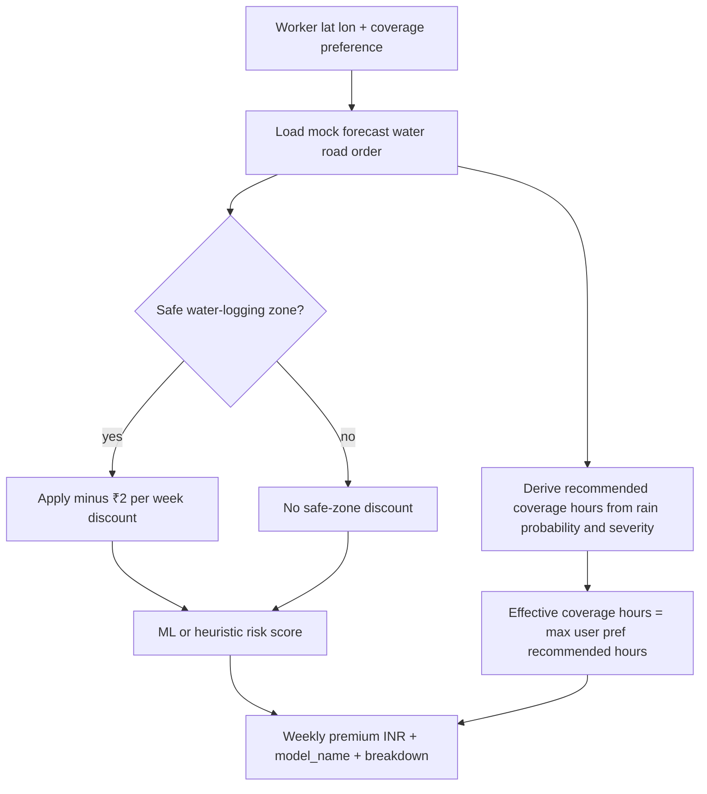
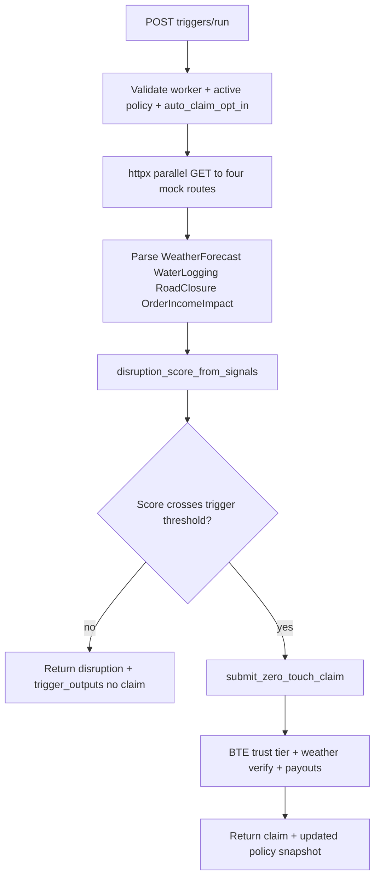
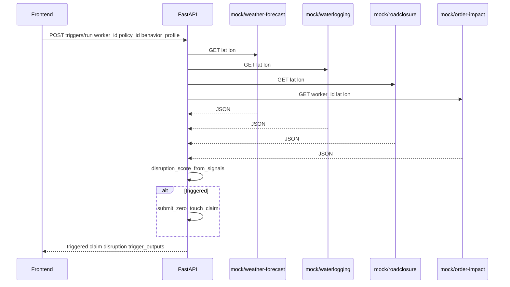
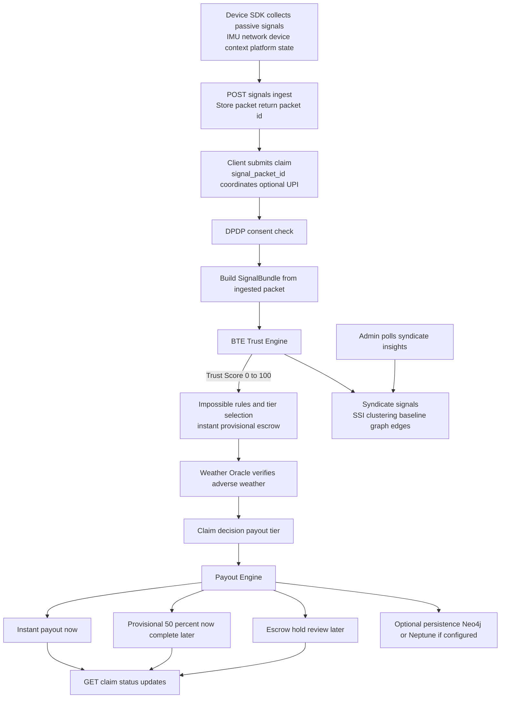

# VIGIL — AI-Powered Parametric Income Protection for Delivery Workers

> DEVTrails 2026 submission: an AI-enabled, weekly-priced, parametric insurance platform for India’s gig delivery workforce, focused **only on income-loss protection** during external disruptions.

This repository implements the full 6-week journey across:

- **Phase 1 (Ideate & Foundation):** persona framing, workflow, risk/fraud strategy, and architecture.
- **Phase 2 (Protect Worker):** onboarding, policy management, dynamic weekly premium, trigger-based claims.
- **Phase 3 (Scale & Optimize):** advanced fraud controls, simulated instant payouts, and intelligent dashboards.

### Source code on GitHub

Canonical remote: **[github.com/akashdeep4303/DevTrails-Phase-2](https://github.com/akashdeep4303/DevTrails-Phase-2)**

```bash
git clone https://github.com/akashdeep4303/DevTrails-Phase-2.git
cd DevTrails-Phase-2
```

**Link a local copy** that is not yet connected:

```bash
cd your-project-folder
git init
git remote add origin https://github.com/akashdeep4303/DevTrails-Phase-2.git
git fetch origin
git checkout -b main
git pull origin main --rebase   # or: --allow-unrelated-histories if histories differ
# make changes, then:
git add -A && git commit -m "Your message"
git push -u origin main
```

If `main` already exists only on GitHub and you want your local tree to become the remote in one step: `git push -u origin main --force` (overwrites remote `main`; use only when you intend to replace history).

---

## DEVTrails 2026 Problem Fit

### Persona focus

The solution is built for **platform delivery partners** (food / quick-commerce / e-commerce style last-mile workers), with workflows optimized for worker IDs, location-based risk, and weekly coverage behavior.

### Golden-rule compliance

1. **Income-loss only**  
   VIGIL covers lost earnings due to external disruptions. It does **not** provide health, life, accident, or vehicle-repair coverage.

2. **Weekly pricing model**  
   Premiums are generated and managed on a **weekly** basis (`₹/week`) and tuned to local disruption risk.

3. **Parametric automation**  
   Claims are triggered from measurable disruption signals (weather/environment + disruption proxies) instead of manual loss-adjustment paperwork.

### Disruptions modeled in this build

- Environmental: rain severity, water logging risk, road closure likelihood
- Economic/proxy impact: predicted order-income drop
- Optional social disruption extension points (curfew/closure signals) supported via mock integration architecture

---

## Phase 3 — Insurer Analytics & Operations Console

Phase 3 adds a monitoring-first admin analytics experience for insurers and operators:

- unified **analytics dashboard** at `/admin/analytics`
- live **scheduler heartbeat** and control panel for automated trigger monitoring
- **behavioral outlier analysis** against aggregate worker baselines
- insurer-facing **loss ratio / premium / payout** KPI views
- **zone hotspot** risk concentration and fingerprint graph visibility
- one-click **Demo mode** configuration for fast walkthroughs

### Deliverables (what shipped)

| Area | Implementation |
|------|------------------|
| Analytics page | `frontend/app/admin/analytics/page.tsx` — KPIs, health, controls, outliers, graph views |
| Insurer analytics API | `GET /api/analytics/insurer` — premiums, payouts, loss ratio, risk outlook, monitoring stats |
| Behavioral analysis API | `GET /api/syndicate/behavioral-analysis` — aggregate metrics + outlier workers |
| Syndicate graph data | `GET /api/syndicate/insights` — clusters, fingerprints, SSI risk, graph edges |
| Scheduler controls | `POST /api/triggers/monitoring-control` — pause/resume, interval and cooldown tuning |
| Scheduler status | `GET /api/triggers/monitoring-status` — runtime telemetry and sampled policy monitor state |
| Snapshot export | Browser-side JSON export from analytics page for ops/debug handoff |
| Demo operations | Demo mode presets for auto-refresh + scheduler timings |

### Analytics console — flow



### Monitoring control model

The analytics console can modify scheduler behavior in real-time:

- `running` — pause or resume scheduler
- `interval_seconds` — how often active policies are scanned
- `cooldown_minutes` — minimum time between auto-claims per policy

These map to the in-memory scheduler stats object in `app.state.monitoring_stats`.

### Phase 3 — Key files

| Layer | Path | Role |
|-------|------|------|
| Frontend | `frontend/app/admin/analytics/page.tsx` | Analytics console UI + controls + demo mode |
| Routers | `backend/routers/analytics.py` | Insurer and worker analytics endpoints |
| Routers | `backend/routers/syndicate.py` | Syndicate insights + behavioral analysis |
| Routers | `backend/routers/triggers.py` | Monitoring status/control endpoints |
| Services | `backend/services/monitoring.py` | Background scheduler loop, cooldown, counters |
| Services | `backend/services/mock_disruption_data.py` | Risk signals feeding insurer outlook |

### Phase 3 API reference

| Method | Path | Purpose |
|--------|------|---------|
| GET | `/api/analytics/insurer?window_days=30` | Insurer KPI and forecast outlook |
| GET | `/api/analytics/worker/{worker_id}` | Worker-level analytics summary |
| GET | `/api/syndicate/behavioral-analysis?window_days=30` | Aggregate + outlier behavior view |
| GET | `/api/syndicate/insights?window_minutes=30` | Clusters, fingerprints, graph edges, SSI |
| GET | `/api/triggers/monitoring-status` | Scheduler telemetry and recent monitor markers |
| POST | `/api/triggers/monitoring-control` | Runtime scheduler config updates |

### Phase 3 demo sequence

1. Open `/admin/analytics`.
2. Enable **Demo mode**.
3. Confirm scheduler is `running` with heartbeat status.
4. Verify interval/cooldown updates in Monitoring Controls.
5. Inspect loss ratio, zone hotspots, and behavior outliers.
6. Export JSON snapshot for reporting/demo evidence.

---

## Phase 2 — Protect Worker

Phase 2 adds an end-to-end **demo-oriented** flow: register a worker, attach an insurance policy with location and preferences, compute a **dynamic weekly premium** from hyper-local mock risk signals, run **automated disruption checks** against mock “external” APIs, and optionally **auto-file a claim** when a composite disruption score crosses a threshold.

### Deliverables (what shipped)

| Area | Implementation |
|------|------------------|
| Worker onboarding | `POST /api/workers/register` — profile, lat/lon, optional UPI, `auto_claim_opt_in` |
| Policy | `POST /api/policies/create`, `GET /api/policies/{id}`, `POST .../recalculate`, `GET .../by-worker/{worker_id}` |
| Weekly premium | `POST /api/premium/weekly` — ML-style / heuristic risk, **₹2/week safe-zone discount** when water-logging mock marks a safe zone, **coverage hours** expand with forecast severity |
| Disruption triggers | `POST /api/triggers/run` — calls **four** mock endpoints in parallel (weather, water logging, road closure, order income impact), merges into a **disruption score** |
| Zero-touch claims | When triggered, `services/auto_claims.submit_zero_touch_claim` runs BTE + weather + payout path using **synthetic signals** chosen by `behavior_profile` (`genuine` / `spoofer` / `syndicate`) |
| Worker claim history | `GET /api/claims/by-worker/{worker_id}` — timeline for `/protect/claims` |
| Mock APIs | `GET /api/mock/weather-forecast`, `waterlogging`, `roadclosure`, `order-impact` — deterministic, location-aware demos |

### Protect Worker — UI to API (flowchart)



### Dynamic weekly premium (flowchart)



### Disruption pipeline → zero-touch claim (flowchart)



### Sequence: run triggers (implementation view)



### Phase 2 — Key files

| Layer | Path | Role |
|-------|------|------|
| Routers | `backend/routers/workers.py` | Worker registration |
| | `backend/routers/policies.py` | Policy CRUD, premium recalc on policy |
| | `backend/routers/premium.py` | Weekly premium endpoint |
| | `backend/routers/triggers.py` | Orchestrates mocks + zero-touch |
| | `backend/routers/mock_apis.py` | Mock disruption data over HTTP |
| | `backend/routers/claims.py` | Includes `GET .../by-worker/{worker_id}` |
| Services | `backend/services/premium.py` | Premium formula, safe zone, hours |
| | `backend/services/premium_ml.py` | Risk model (heuristic / small ML) |
| | `backend/services/mock_disruption_data.py` | Typed mocks + disruption aggregation |
| | `backend/services/auto_claims.py` | Zero-touch claim + synthetic signals by profile |
| Frontend | `frontend/app/protect/page.tsx` | Full Protect Worker demo |
| | `frontend/app/protect/claims/page.tsx` | Per-worker claim list |
| Model artifact | `backend/models/premium_model.json` | Optional trained weights for premium ML |

---

## Phase 1 — Ideation & Foundation (what this repo established)

### Core strategy

- Protect delivery workers against **external disruption-driven income loss**
- Use **multi-signal trust + anomaly checks** to reduce false/fraudulent claims
- Keep user workflow simple: register -> create weekly policy -> run triggers -> receive payout status

### AI/ML plan implemented

- **Dynamic premium calculation:** risk-informed weekly premium using environmental and disruption predictors (`services/premium.py`, `services/premium_ml.py`)
- **Fraud and trust scoring:** Behavioral Trust Engine + impossible-combination logic + syndicate suspicion indexing (`services/bte.py`, `routers/syndicate.py`)
- **Predictive insights:** insurer forecast/risk outlook and outlier behavior analytics (`routers/analytics.py`, `routers/syndicate.py`)

### Platform choice

- **Web-first** implementation (Next.js + FastAPI) for rapid demoability, clear admin visibility, and easier integration/mocking during the hackathon window.

### Tech stack

- Frontend: Next.js (App Router), React, TypeScript, Tailwind-style utility classes
- Backend: FastAPI, Pydantic, asyncio/httpx
- ML/heuristics: numpy/scikit-learn + rule-based scoring where appropriate
- Persistence: in-memory default, optional Neo4j / Neptune hooks
- Payout simulation: mock + Razorpay-test compatible abstraction

---

## Must-Have Requirement Mapping

| DEVTrails Requirement | VIGIL Implementation |
|---|---|
| AI-powered risk assessment | Weekly premium model with risk features + recommendation logic |
| Intelligent fraud detection | BTE trust score, impossible combinations, fingerprint/cluster insights |
| Parametric automation | Trigger runner, disruption score, auto-claim flow |
| Real-time / near-real monitoring | Scheduler loop + monitoring control/status endpoints |
| Instant payout processing (simulated) | Tiered payout engine with immediate/provisional/escrow simulated rails |
| Integration capabilities | Mock weather, water logging, road closure, order impact APIs; payout abstraction |
| Worker dashboard relevance | Protect flow + claims history |
| Insurer analytics relevance | Loss ratio, payouts, risk hotspots, behavior outliers, scheduler health |

---

## Phase-Wise Deliverable Alignment

### Phase 1 (Weeks 1-2): Ideation & Foundation

- Persona-first architecture and weekly model definition represented in this README and code structure.
- Clear parametric triggers, fraud strategy, and workflow design implemented.

### Phase 2 (Weeks 3-4): Automation & Protection

- Registration process (`/api/workers/register`)
- Policy management (`/api/policies/create`, `/api/policies/{id}`, recalculate flows)
- Dynamic weekly premium (`/api/premium/weekly`)
- Claims management with trigger pathway (`/api/triggers/run`, `/api/claims/*`)
- 3-5 disruption triggers via mock/public-style APIs (`/api/mock/*`)

### Phase 3 (Weeks 5-6): Scale & Optimize

- Advanced fraud patterns: spoofing/syndicate behavior profiles, cluster analysis
- Simulated instant payout pipeline with tiered settlement behavior
- Worker and insurer/admin intelligence dashboards (`/protect/claims`, `/admin`, `/admin/analytics`)
- Final demo-ready automation path from disruption trigger to payout state transition

---

## Final Submission Support Checklist

Use this as a practical checklist while packaging Week 6 artefacts:

- [ ] 5-minute walkthrough shows end-to-end disruption -> claim -> payout status
- [ ] Weekly pricing model logic explained with risk factors
- [ ] Fraud architecture explained (BTE + anomaly + duplicate/syndicate controls)
- [ ] Worker value shown: active weekly coverage + protected earnings
- [ ] Insurer value shown: loss ratio + predictive outlook + hotspot analytics
- [ ] Pitch deck includes business viability of weekly premium construct

---

## Phase 1 — Manual weather claim (recap)

The worker’s claim becomes valid only when **(1)** adverse weather is verified for the claimed coordinates and **(2)** the worker’s signals show realistic, convergent behavior consistent with being in motion during bad weather.

### End-to-end flow — manual claim (flowchart)



## Differentiation: genuine vs bad actor (anti-spoofing)

**Key idea:** a GPS spoofing app can often forge *coordinates*, but it cannot reliably forge the *convergence* of:

1. Physical motion patterns (IMU, steps, rotation events)
2. Network movement reality (cell handoffs and signal variance)
3. Device context consistency (battery drain, app state, screen interaction)
4. Platform reality (recent order activity)
5. Ring-level coordination signals (temporal clustering, fingerprint co-occurrence)

### Impossible combination escalation

Even if a worker’s Trust Score looks acceptable, a claim is escalated when **two or more** “impossible” conditions occur together:

- **Home Wi‑Fi + claimed storm-zone presence**
- **Claimed movement + stationary IMU behavior**
- **No realistic network movement** while coordinates imply travel

## Data: signal layers (beyond GPS)

VIGIL analyzes **9 passive signal layers** at claim time (see `/approach` in the app for the full narrative): IMU, network/cell, device context, order-platform cross-checks, and syndicate graph signals (clustering, fingerprints, staggered triggers, behavioral baselines).

---

## API reference (combined)

### Phase 1 — claims, signals, syndicate, weather

| Method | Path | Purpose |
|--------|------|---------|
| POST | `/api/signals/ingest` | Ingest device packet → `packet_id` |
| POST | `/api/claims/submit` | Manual claim with `signal_packet_id` |
| GET | `/api/claims/{claim_id}` | Payout status (polling) |
| GET | `/api/claims/recent` | Admin recent claims |
| POST | `/api/claims/{claim_id}/media` | Optional Tier-3 media metadata |
| GET | `/api/syndicate/insights` | Clustering, SSI, fingerprints |
| GET | `/api/weather/at` | Weather Oracle for coordinates |

### Phase 2 — workers, policies, premium, triggers, mocks

| Method | Path | Purpose |
|--------|------|---------|
| POST | `/api/workers/register` | Register worker profile |
| GET | `/api/workers/{worker_id}` | Fetch worker |
| POST | `/api/policies/create` | Create policy for worker |
| GET | `/api/policies/{policy_id}` | Policy detail |
| GET | `/api/policies/by-worker/{worker_id}` | List policies |
| POST | `/api/policies/{policy_id}/recalculate` | Recompute premium on policy |
| POST | `/api/premium/weekly` | Weekly premium + breakdown |
| POST | `/api/triggers/run` | Run four mocks → optional zero-touch claim |
| GET | `/api/mock/weather-forecast` | Mock forecast `lat` `lon` |
| GET | `/api/mock/waterlogging` | Mock water risk + `safe_zone` |
| GET | `/api/mock/roadclosure` | Mock closure probability |
| GET | `/api/mock/order-impact` | Mock income loss `worker_id` `lat` `lon` |
| GET | `/api/claims/by-worker/{worker_id}` | Claims for one worker |

### Phase 3 — analytics, behavior, operations

| Method | Path | Purpose |
|--------|------|---------|
| GET | `/api/analytics/insurer?window_days=30` | Insurer KPIs, loss ratio, forecast outlook |
| GET | `/api/analytics/worker/{worker_id}` | Worker earnings/claims analytics |
| GET | `/api/syndicate/behavioral-analysis?window_days=30` | Aggregate baselines + outlier workers |
| GET | `/api/triggers/monitoring-status` | Scheduler state and telemetry |
| POST | `/api/triggers/monitoring-control` | Runtime control of scheduler interval/cooldown/running state |

### DPDP consent (server-side)

Set `REQUIRE_CONSENT=true`. Clients must send header `x-vigil-consent: accepted` on protected routes.

### Weather Oracle (manual claims)

Uses OpenWeatherMap if `OPENWEATHER_API_KEY` is set; deterministic mock fallback for local dev.

### Persistence (Neo4j / Neptune)

- `PERSISTENCE_BACKEND=neo4j` with `NEO4J_URI`, `NEO4J_USER`, `NEO4J_PASSWORD`
- `PERSISTENCE_BACKEND=neptune` with `NEPTUNE_SPARQL_ENDPOINT`

If not configured, in-memory stores are used.

### Razorpay / UPI

Real payouts only when keys and UPI are present: `RAZORPAY_KEY_ID`, `RAZORPAY_KEY_SECRET`, `DEFAULT_WORKER_UPI` or per-request `upi_handle`.

### Trigger runner base URL

`POST /api/triggers/run` calls mock routes via `httpx`. Override with `VIGIL_API_BASE_URL_OVERRIDE` if the API is not reachable at `request.base_url` (e.g. certain proxy setups).

---

## Quick start

```bash
# One-time setup
npm install
cd frontend && npm install && cd ..
pip install -r backend/requirements.txt

# API + Next.js together (API on 8004 by default; frontend rewrites /api/*)
npm run dev
```

Open **http://localhost:3000**.

If Next.js file watchers hit **EMFILE** on macOS, use polling-enabled dev (already set in root `dev:web`) or clear cache:

```bash
npm run dev:clean
```

---

## Project structure

```
.
├── backend/
│   ├── main.py                 # FastAPI app, routers, in-memory stores
│   ├── routers/                # claims, workers, policies, premium, triggers, mock_apis, …
│   ├── services/               # BTE, payouts, premium, auto_claims, mock_disruption_data, …
│   └── models/                 # e.g. premium_model.json
├── frontend/
│   ├── app/                    # Next.js App Router pages
│   │   ├── page.tsx            # Home
│   │   ├── claim/              # Manual weather claim
│   │   ├── protect/            # Phase 2 Protect Worker
│   │   ├── admin/              # Syndicate console
│   │   └── …
│   ├── components/             # Header, Card, PageBackdrop, …
│   └── public/backdrops/       # Themed SVG backgrounds (optional)
├── package.json                # dev, dev:api, dev:web, dev:clean
└── README.md
```

---

## License

MIT — open core, proprietary BTE model weights
